## Screenshots

#### Splash Screen

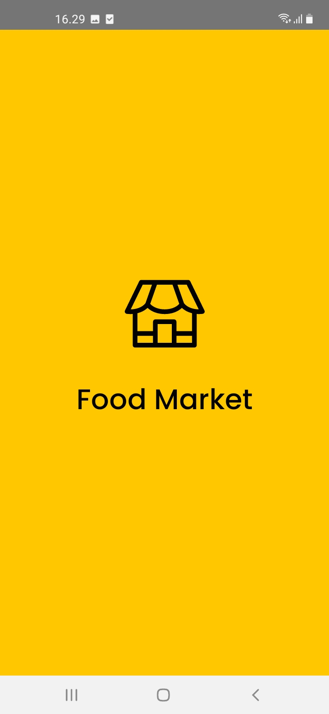

#### Sign In Screen

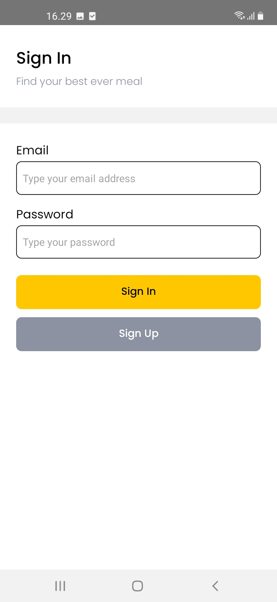

#### Sign Up Screen

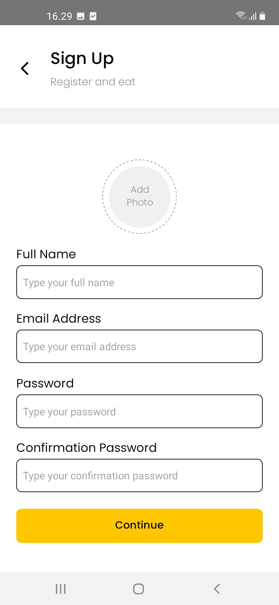

#### Home Screen

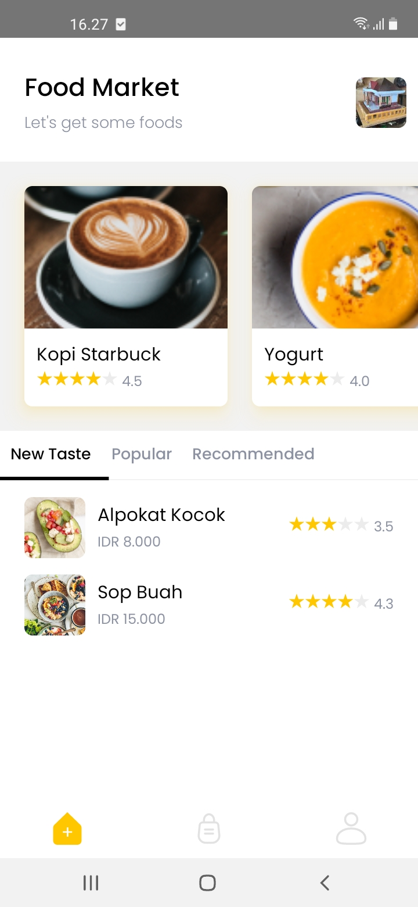

#### Detail Food Screen

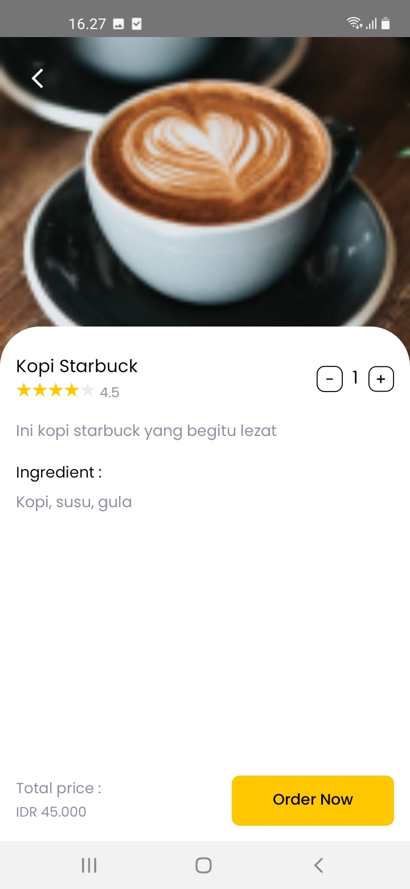

#### Order Screen

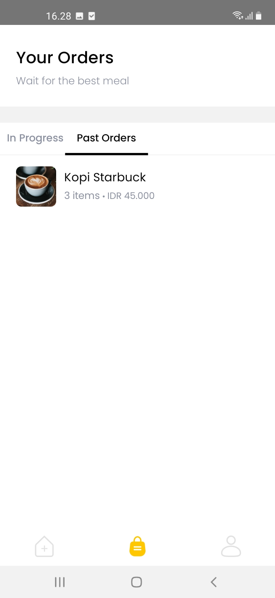

#### Order Summary Screen

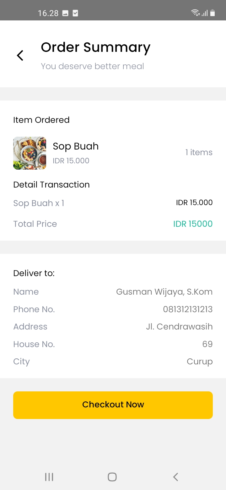

#### Order Detail Screen

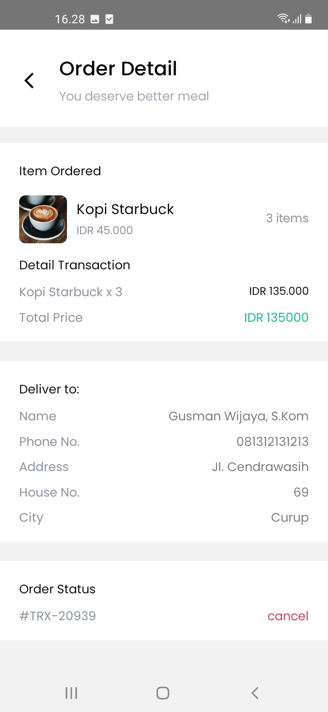

#### Payment Screen

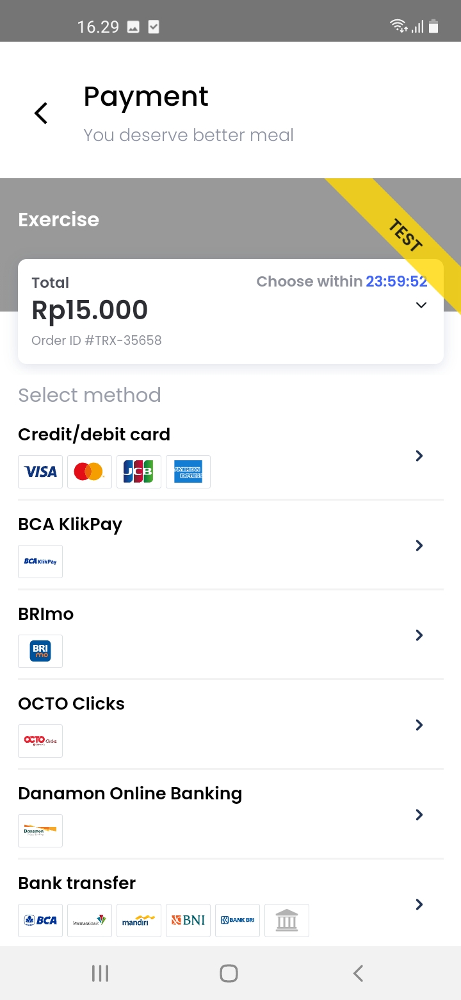

#### Profile Screen

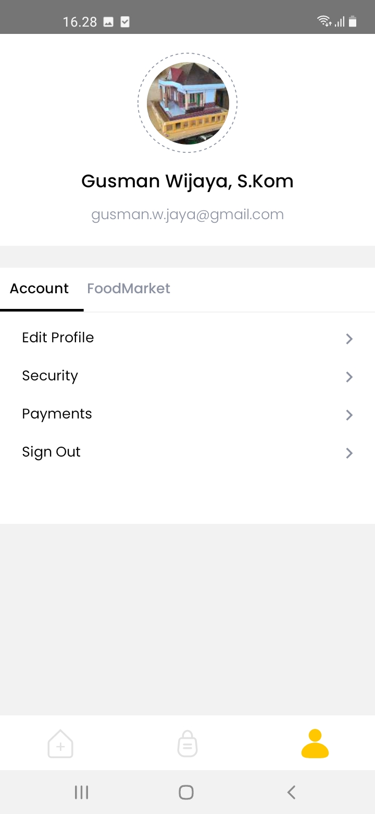

#### Edit Profile Screen

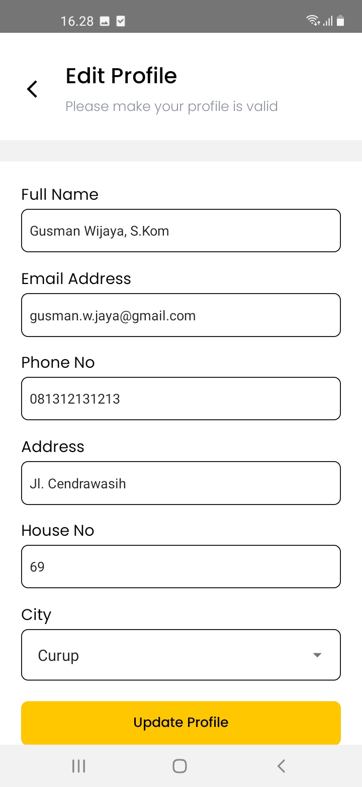

## Clone & Install Instructions (Nodejs v16.17.0 and React Native v0.69.4)

```bash
git clone https://github.com/gusmanwijaya/exercise-app-sequelize.git foodmarket
cd foodmarket
npm install || yarn install
```

## Before Run

- Link assets to app:

```bash
npx react-native-asset
npx pod install
```

### Run on Android

```bash
npx react-native start
npx react-native run-android
```

### Run on iOS

```bash
npx react-native start
npx react-native run-ios
```

### Developer

Gusman Wijaya, S.Kom
